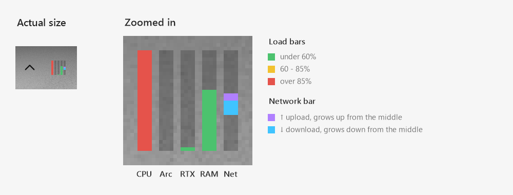
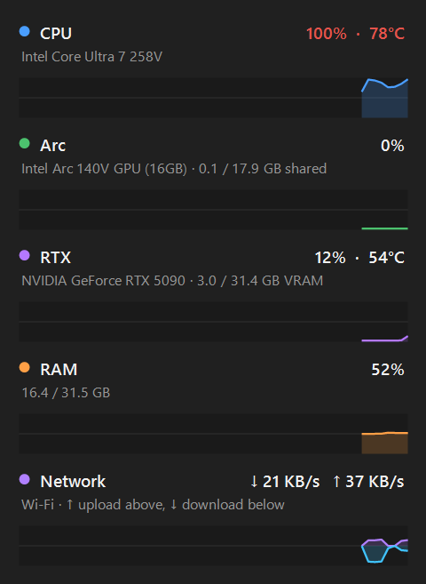

# PCStatus

A tiny Windows tray app that shows live **CPU, GPU, RAM and network usage** as mini bars right in the taskbar's system tray, with a click-open panel for details.



Click the icon for the detail panel:



## Features

- **Tray icon with live bars:** CPU, one bar per GPU, RAM. Each bar is green, yellow or red by load, and updates every second.
- **Network in a single bar:** upload grows up from the middle (violet) and download grows down from it (blue). It uses a log scale from 1 KB/s to 100 MB/s, so light browsing and big downloads both show. Only physical adapters are counted, so VPNs and virtual switches aren't double-counted.
- **Every GPU shown separately:** for example an integrated Intel Arc *and* a dedicated or external NVIDIA RTX. Works with any number of GPUs, including none. GPUs that are plugged in or removed while it runs (eGPUs) appear and disappear within a few seconds.
- **Detail panel:** click the icon to see usage %, CPU and GPU temperatures, VRAM / shared GPU memory, download and upload speed, and a 60-second history graph for each.
- **Doesn't wake a sleeping laptop dGPU:** GPU temperature is only read while the GPU is in use.
- **Start with Windows:** optional, with no UAC prompt at every logon.
- **Lightweight:** about 50 MB RAM and well under 1% CPU.

## Install

1. Download `PCStatusSetup-x.y.z.exe` from the [latest release](../../releases/latest).
2. Run it.
   - Windows SmartScreen may warn because the installer isn't code-signed. Click **More info → Run anyway**.
3. Windows 11 hides new tray icons. Click **^** in the tray and drag PCStatus onto the taskbar, or enable it under *Settings → Personalization → Taskbar → Other system tray icons*.

**Requirements:** 64-bit Windows 10 (1809+) or Windows 11, on x64 or ARM64. Nothing else needs to be installed.

### CPU temperature

Windows doesn't expose CPU temperature to normal apps. PCStatus reads it through [LibreHardwareMonitor](https://github.com/LibreHardwareMonitor/LibreHardwareMonitor), which needs:

- the **PawnIO** driver. The installer offers to download and install it for you.
- **administrator rights.** The installer's "Start with Windows" option runs PCStatus elevated without a prompt.

On a standard (non-admin) account everything works except CPU temperature.

## Usage

| Action | Result |
|---|---|
| Hover the tray icon | Tooltip with all values, e.g. `CPU 23% 54° \| Arc 4% \| RTX 12% 51° \| RAM 48% \| ↓ 12.3 MB/s ↑ 450 KB/s` |
| Left-click | Open / close the detail panel |
| Right-click | *Start with Windows* toggle, *Exit* |

## Building from source

Requires the [.NET 10 SDK](https://dotnet.microsoft.com/download) and, for the installer, [Inno Setup 6](https://jrsoftware.org/isinfo.php).

```powershell
dotnet build                     # debug build
.\installer\build.ps1            # x64 + ARM64 exes and dist\PCStatusSetup-<version>.exe
```

`PCStatus.exe --selftest out.txt` writes a few seconds of sensor readings to `out.txt` and renders the icon and panel to PNGs next to it. It's handy for checking a new machine.

### How it works

| Data | Source |
|---|---|
| CPU % | PDH `\Processor Information(_Total)\% Processor Utility`, the same value Task Manager shows |
| GPU % | PDH `\GPU Engine(*)\Utilization Percentage`, busiest engine per adapter |
| GPU memory | PDH `\GPU Adapter Memory(*)` |
| GPU list | DXGI adapters |
| RAM | `GlobalMemoryStatusEx` |
| Network | `GetIfTable2`, summed over physical (hardware) interfaces that are up |
| Temperatures | LibreHardwareMonitorLib (CPU via PawnIO) |

## License

[MIT](LICENSE). Third-party components are listed in [THIRD-PARTY-NOTICES.md](THIRD-PARTY-NOTICES.md).
